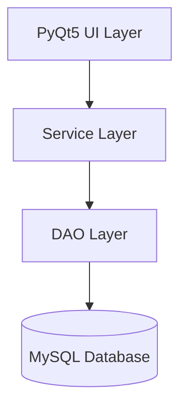

# Project Report: Airlines Reservation System

## 1. Project Overview
The **Airlines Reservation System** is a comprehensive desktop application designed to streamline the process of flight bookings, passenger management, and administrative operations. Built using **Python (PyQt5)** and **MySQL**, the system provides a robust platform for both customers to book flights and administrators to manage the airline's infrastructure.

## 2. Objectives
- To automate the flight booking process.
- To provide a secure and user-friendly interface for travelers.
- To enable administrators to manage flights, airlines, and airports efficiently.
- To maintain accurate records of bookings, payments, and passenger details.

## 3. System Architecture
The application follows a **Modular Layered Architecture** to ensure maintainability and scalability:

- **UI Layer (PyQt5):** Handles user interactions and data presentation.
- **Service Layer:** Contains business logic (e.g., booking validation, seat assignment).
- **DAO Layer (Data Access Object):** Manages SQL queries and database interactions.
- **Database (MySQL):** Persistent storage for all system data.

## 4. Technology Stack
- **Programming Language:** Python 3.x
- **GUI Framework:** PyQt5 (Modernized with Catppuccin Dark Theme)
- **Database:** MySQL
- **Database Connector:** `mysql-connector-python`

## 5. Database Design
The system uses a relational database schema consisting of 8 primary tables:

| Table Name | Description |
| :--- | :--- |
| **USERS** | Stores account details for Admins and Customers. |
| **AIRLINE** | Contains information about different airline carriers. |
| **AIRPORT** | Lists airport details, city, and country. |
| **FLIGHT** | Manages flight schedules, routes, and seat availability. |
| **PASSENGER** | Stores individual passenger details (linked to bookings). |
| **BOOKING** | Records booking transactions and statuses. |
| **BOOKING_PASSENGER** | Maps passengers to specific bookings and assigns seat numbers. |
| **PAYMENT** | Tracks financial transactions for each booking. |

## 6. Functional Modules

### A. Customer Module
- **User Authentication:** Secure Sign-up and Login functionality.
- **Flight Search:** Search flights based on source, destination, and date.
- **Booking Management:** 
    - Real-time seat availability check.
    - Multi-passenger booking support.
    - Automatic seat assignment (e.g., 12B, 4F).
- **My Bookings:** View booking history and current status.
- **Cancellation:** Ability to cancel bookings with automatic seat restoration.

### B. Admin Module
- **Flight Management:** Create, Update, and Delete flight schedules.
- **Infrastructure Management:** Manage Airlines and Airports databases.
- **Booking Oversight:** View and monitor all customer bookings and payment statuses.

## 7. Key Features & Highlights
- **Automated Seat Management:** The system automatically assigns seats during booking and frees them up upon cancellation.
- **Transaction Integrity:** Uses a structured DAO pattern to ensure database consistency.
- **Modern User Experience:** Implements a premium "Catppuccin" dark theme for a professional and eye-soothing look.
- **Relational Integrity:** Leveraging MySQL foreign keys and cascades to maintain data hygiene.

## 8. Conclusion
The Airlines Reservation System successfully bridges the gap between complex airline operations and user-friendly booking experiences. Its modular design allows for future enhancements such as real-time API integrations, advanced pricing algorithms, and mobile-responsive web interfaces.
